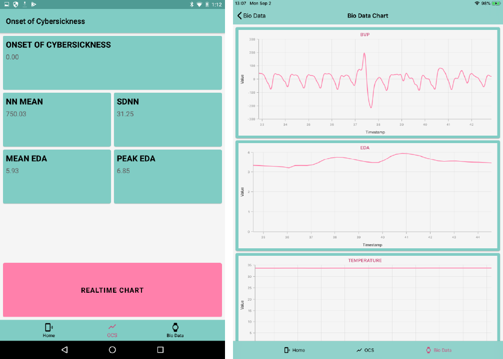

<div align="center">
    
</div>

# Cybatica

Cybatica shows visualizing physiological data and forecasting a cybersickness from physiological signals using Empatica E4.  
The application was developed using Xamarin.Forms.



## Requirement

- [Empatica E4](https://www.empatica.com/research/e4/)
- [E4 Developer Account](https://www.empatica.com/connect/developer.php)
- [Syncfusion Account](https://www.syncfusion.com/)

## Platform

- Android 6.0+
- iOS 12+

## Setup

Please setup a development environment of Xamarin. (see [Get Started with Xamarin](https://docs.microsoft.com/en-us/xamarin/get-started/))  
Then, restore NuGet packages.

### API keys

Add `AppPrivateInformations.cs` file to project of `Cybatica`.  

```cs:AppPrivateInformations.cs
namespace Cybatica
{
    public static class AppPrivateInformations
    {
        public static string EmpaticaApiKey = "Your E4 Developer License Key";
        public static string SyncfusionLicenseKey = "Your Syncfusion License Key";
    }
}
```

#### E4 Developer License Key

Logon in [E4 connect](https://www.empatica.com/connect/dashboard.php), then you can get API key in [Developer Profile](https://www.empatica.com/connect/developer.php).  

#### Syncfusion License Key

Logon in [Syncfusion](https://www.syncfusion.com/account), then you need to purchase or trial [Xamarin UI components](https://www.syncfusion.com/xamarin-ui-controls).

### Create Binding Library

The application needs to create binding library of each platforms.

#### Android

`Empalink` sdk is downloads from Developer Profile page.  
Then, create a binding library according to [Binding an .AAR](https://docs.microsoft.com/en-us/xamarin/android/platform/binding-java-library/binding-an-aar)  
Some errors will occur when building, so fix its. (e.g. `Delegate` to `System.Delegate`)  
Add .dll reference to project of `Cybatica.Android`

#### iOS
  
`E4link` sdk is downloads from Developer Profile page.  
If you develop on Windows, you change extension of E4link file from `E4link` to `E4link.a` when add E4link file to binding project.  
Then, create a binding library according to [Binding an iOS Objective-C Library](https://docs.microsoft.com/en-us/xamarin/ios/platform/binding-objective-c/walkthrough)  
And, add some property in `E4link.linkwith.cs`.

```cs:E4link.linkwith.cs
using ObjCRuntime;

[assembly: LinkWith("E4link.a", LinkTarget = LinkTarget.Simulator | LinkTarget.Arm64 | LinkTarget.ArmV7,
    ForceLoad = true, SmartLink = true, Frameworks = "Foundation UIKit Accelerate",
    WeakFrameworks = "CoreBluetooth", LinkerFlags = "-ObjC -lz")]

```

Add .dll reference to project of `Cybatica.iOS`
